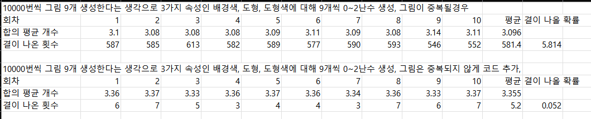
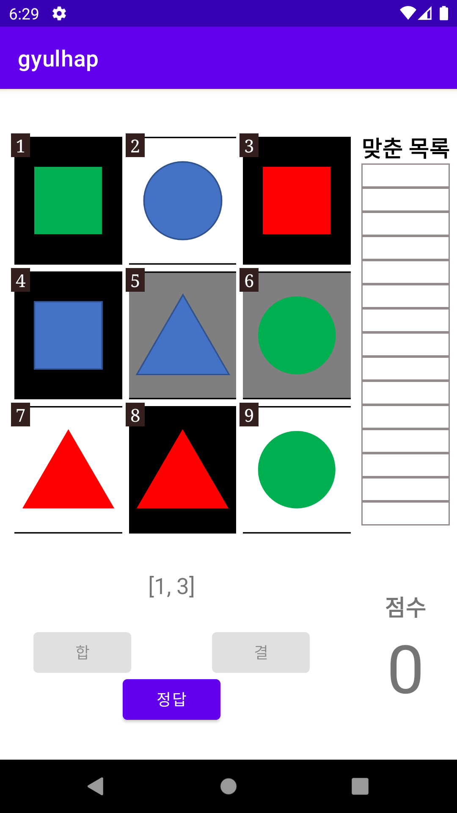
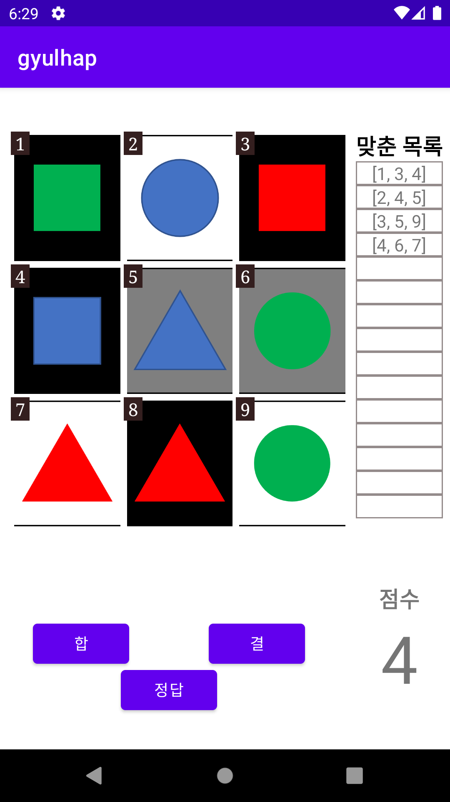
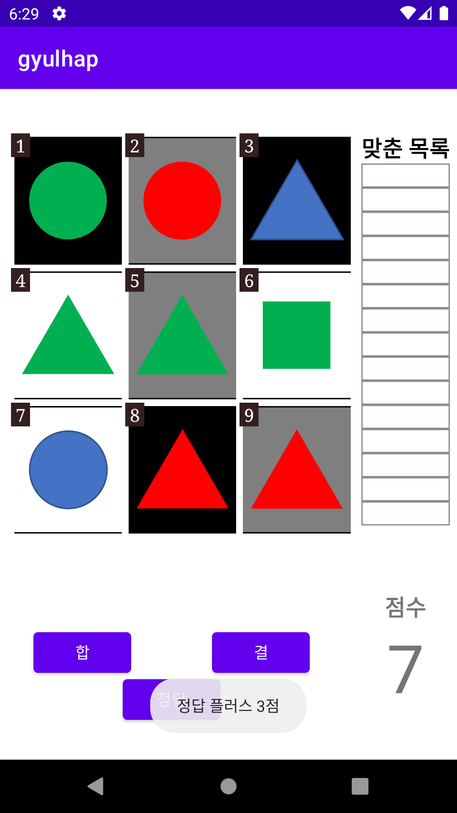

# gyulhap
자바와 객체지향프로그래밍 프로젝트

# 2021.11.18
## 결합 그림을 난수로 생성시 결과
### 그림 생성을 10000번씩 총 10번한 결과 표다

중복을 허용하고 했을 때 결이 5%정도 확률로 나왔으나 그림은 중복되면 안되기 때문에 다시 코드를 짰다   
중복을 제거하고 하니 한판당 합의 개수는 비슷하게 나오고 결이 나올 확률은 크게 감소했다.   
코드는 RandomGyulhapTest.java 에 올려놓았다.   
난수를 이용해 프로젝트를 진행하는 것으로 결정했다.

# 2021.11.19
결합 게임 클래스를 자바로 먼저 작성해봄.   
클래스 내부에 속성들 리스트와 이를 이용해 합을 찾는 코드를 작성   
코드는 확인용코드 폴더에 Game.java로 올려둠

# 2021.11.22 
결합 클래스에서 생성한 속성값들을 기반으로 각 그림을 표시하는 기능을 추가했다.   
3진법을 이용해서 값에 맞는 그림을 가져올 수 있다. 배경색에는 9를 곱하고 도형 색에 3을 곱하고 모양에는 1을 곱해서 더하면 원하는 그림을 가져온다.   
그리고 앞으로 합이나 결같은 기능을 구현하려면 답을 알고 있는 것이 좋기 때문에 임시적으로 버튼을 하나 만들었다.   
이 버튼은 누르면 Toast기능을 통해 일시적으로 답을 전부 보여준다.   
다음으로 구현할 기능은 아마 결을 먼저하고 합을 진행할 것 같다.   
결은 리스트가 비어있으면 맞고 아니면 틀린 것을 먼저 하고 다음 게임으로 넘어가는건 나중에 할 것이다.   
결의 일부를 만들면 이후에 합을 구현할 것이다.

# 2021.11.26
그림을 만들고 답을 작성하는 클래스인 결합 클래스를 따로 파일로 분리했다.   
그리고 게임에서 필요하다고 생각되는 기본적인 요소들도 얼추 완성했다.   
결 : 답이 들어있는 리스트가 비어있으면 정답 +3점을 하고 새게임을 실행한다. 점수는 물론 유지된다. 그리고 맞춘 것을 기록해놓은 표도 초기화된다.   
합 : 합을 외칠 때에는 먼저 합 버튼을 누르면 합과 결 버튼이 쓸 수 없게 바뀐다. 그리고 그림 버튼도 쓸 수 있게 바뀐다. 이후 버튼을 누르면 TreeSet에 위치에 맞는 수가 삽입되고
 3번째 그림을 누르면 정답을 확인하고 그에 맞는 점수를 부여한다. 그리고 맞춘 정답은 리스트에서 삭제되고 옆의 표에 기록된다. 그림을 누르는 동안 어떤 그림을 눌렀는지 확인이 불가능하여
 그림과 버튼 사이에 현재 누른 버튼을 출력시켰다. 더 지니어스 프로그램에 나온 것처럼 만들고 싶어서 합 버튼을 먼저 누르는 것으로 했다. 만약 누르면 낙장불입이다. 무조건 맞춰야 한다.   
 다음은 컴퓨터 대전을 만들어야 한다. 화면 구성부터 좀 바뀌기 때문에 구성 먼저 하고 컴퓨터가 어떤 식으로 답을 맞출지 구상하고 진행해야겠다. 그리고 라운드나 타이머등 새 기술들도 많이 생기기 때문에 시간이 좀 걸릴 것 같다.   
 게임 방법 이미지도 합 버튼에 대한 설명을 추가해야겠다. 그리고 정답을 보여주는 버튼도 마지막에는 없애야한다.   

  
   
  

